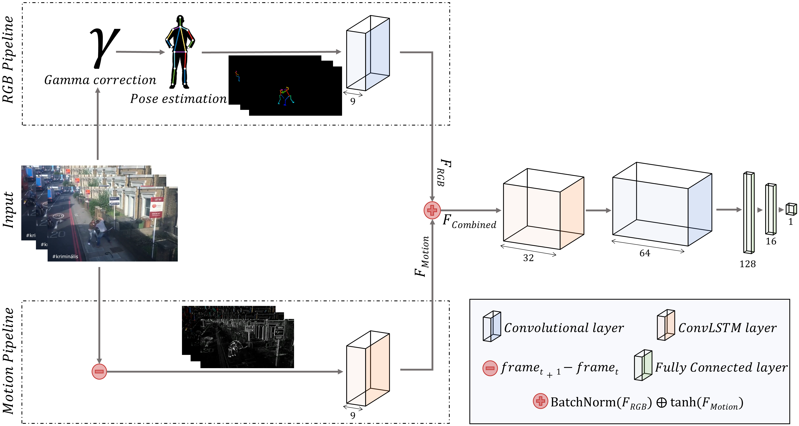
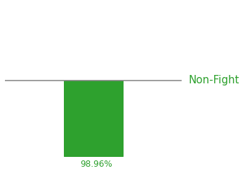

# Human Skeletons and Change Detection for Efficient Violence Detection in Surveillance Videos

[](https://paperswithcode.com/sota/activity-recognition-on-rwf-2000?p=human-skeletons-and-change-detection-for)

This is the GitHub repository associated with the paper [Human Skeletons and Change Detection for Efficient Violence Detection in Surveillance Videos](https://www.sciencedirect.com/science/article/pii/S1077314223001194), published in Computer Vision and Image Understanding (CVIU), vol. 233, 2023. The method achieves 90.25% accuracy in the RWF-2000 validation set with just 60k trainable parameters.

<p align="center">
  
</p>

The purpose of this repository is to provide the code needed to replicate the results of the paper. Moreover, the training logs of all the experiments are also included.

<details>
  <summary>Table of Contents</summary>
  <ol>
    <li><a href="#demo">Demo</a></li>
    <li><a href="#prerequisites">Prerequisites</a></li>
    <li><a href="#preprocessing">Preprocessing</a></li>
    <li><a href="#training">Training</a></li>
    <li><a href="#inference">Inference</a></li>
    <li><a href="#citation">Citation</a></li>
  </ol>
</details>

## Demo


To demonstrate the ability of our proposal to detect violence in real-life scenarios, we have executed our best model with two videos that are not present in any of the datasets. In the second video, a girl is brutally beaten outside of a bar in Murcia, a city in southern Spain ([news report](https://www.laopiniondemurcia.es/murcia/2017/01/23/brutal-paliza-chica-centro-murcia-31944907.html)).

## Prerequisites

### Conda environment

The `enviroment.yml` file contains all the dependencies used during the development of this project. You can create the corresponding conda environment by running the following command:

```bash
conda env create -f environment.yml
```

### Datasets

If you would like to train or validate a model, you will need one of the datasets that were used in the paper. Find below their links:

* [RWF-2000](https://github.com/mchengny/RWF2000-Video-Database-for-Violence-Detection): as stated in the paper, this is the main dataset that we have used to train and validate our model. The authors of the original dataset require the signing of an [Agreement Sheet](https://github.com/mchengny/RWF2000-Video-Database-for-Violence-Detection#download) to grant access.

* [Hockey](https://www.kaggle.com/datasets/yassershrief/hockey-fight-vidoes)

* [Movies](https://academictorrents.com/download/70e0794e2292fc051a13f05ea6f5b6c16f3d3635.torrent)

* [Crowd](https://www.openu.ac.il/home/hassner/data/violentflows/)

### OpenPose

Apart from the data, one of the essential components of our proposal is the skeletons' detector. As mentioned in the paper, we use OpenPose. Please, follow their [instalation guide](https://github.com/CMU-Perceptual-Computing-Lab/openpose/blob/master/doc/installation/0_index.md) to compile the library and be able to extract skeletons. A complementary installation guide is available at [this link](https://amir-yazdani.github.io/post/openpose/). 

## Preprocessing

Once you have compiled the OpenPose library, you can use our `preprocess.py` script to extract the skeletons from the videos of your choice. The script also applies a gamma correction before extracting the skeletons, which can be disabled.

## Training

All the notebooks required to reproduce the results of the paper in terms of training and validation are included in the [`experiments`](https://github.com/atmguille/Violence-Detection-With-Human-Skeletons/tree/main/experiments) directory. The training logs with the results reported in our paper are provided inside each notebook. For the RWF-2000 dataset, a summary of the results is also provided in the [`experiments/RWF-2000/results_summary`](https://github.com/atmguille/Violence-Detection-With-Human-Skeletons/tree/main/experiments/RWF-2000/results_summary) directory. Note that some extra, less important, experiments not reported in the paper are included in these directories for this last dataset.

## Inference

Once you have trained a model, you can try to detect violence in a video of your choice. First of all, you have to use the `preprocess.py` script to extract the skeletons. Afterward, you can use the `inference.ipynb` notebook to perform the inference. This notebook will output a sequence of frames with the predicted probabilites of violence. Find an example of a frame with a predicted probability below: 

<p align="center">
  
</p>

With this frames, you can render a video with the aggreagted predictions using [FFmpeg](https://ffmpeg.org/), which can then be merged with the original video to obtain what is shown in the Demo. The command is:
    
```bash
ffmpeg -i predictions/VIDEO_NAME-%d.png -r 10 output.mp4
```

## Citation

Please cite our paper if this work helps your research:

```
@article{GARCIACOBO2023SkeletonsViolence,
  title = {Human skeletons and change detection for efficient violence detection in surveillance videos},
  journal = {Computer Vision and Image Understanding},
  volume = {233},
  pages = {103739},
  year = {2023},
  issn = {1077-3142},
  doi = {https://doi.org/10.1016/j.cviu.2023.103739},
  url = {https://www.sciencedirect.com/science/article/pii/S1077314223001194},
  author = {Guillermo Garcia-Cobo and Juan C. SanMiguel}
}
```
